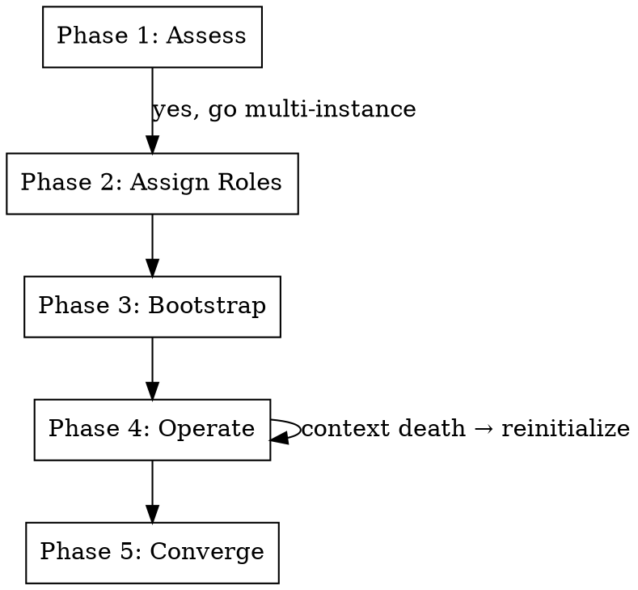
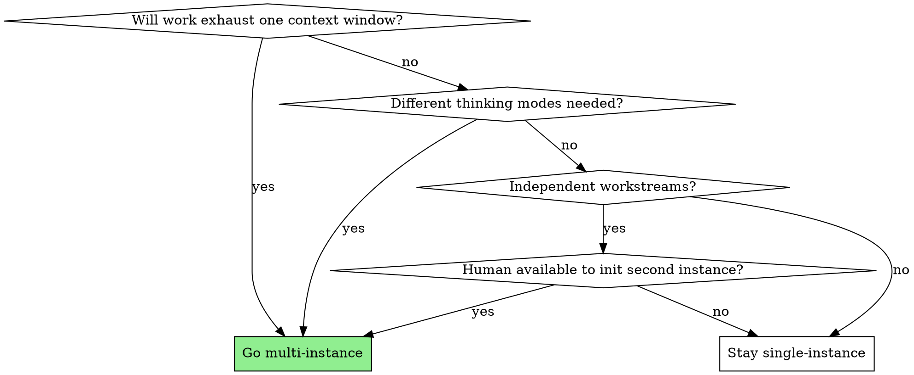

# Multi-Instance Coordination

Coordinate multiple AI agent instances on a shared codebase through durable artifacts — not shared memory, not conversation history.

**Core insight:** Conversation history is ephemeral. Documents survive context death. Build coordination on documents, and instances become replaceable.

**Not for intra-session parallelism.** If your work fits in one context window and you just need subagents, use `dispatching-parallel-agents` or `subagent-driven-development` instead. This skill is for work that spans multiple independent sessions.

## Five Principles

These are non-negotiable. Every phase of the lifecycle enforces them.

1. **Append-only coordination.** The comms artifact is never edited, only appended. This prevents edit conflicts and preserves the full decision trail.
2. **Boot prompts survive context death.** Every instance can be reinitialized from a document. If the document doesn't exist, the knowledge doesn't transfer.
3. **Documents are the API between instances.** If it's not in a doc, it doesn't transfer. Conversation history is ephemeral; artifacts are durable.
4. **Git log is the progress report.** Don't burn context documenting what commits already show.
5. **Persist before death.** If below 15% context, stop working and start persisting — handoff message, memory update, remaining task list.

## The Lifecycle

Five phases, with entry points at each. Jump to wherever you are.



---

## Phase 1: Assess

Should this be multi-instance?



**Signals that multi-instance will help:**
- The task involves both design (divergent thinking) and implementation (convergent thinking) — fresh context for each mode produces better results
- Multiple subsystems can be built independently with clean interfaces
- The codebase is large enough that reading it consumes significant context
- Previous attempts hit context limits before finishing

**Signals to stay single-instance:**
- All tasks are tightly coupled (editing the same files)
- The work fits comfortably in one context window
- You just need parallelism, not persistent coordination — use `dispatching-parallel-agents`

---

## Phase 2: Assign Roles

Two validated patterns. Pick one based on the work.

### Architect + Builder

One instance designs and reviews. The other implements. The architect holds the big picture and validates against the design. The builder gets fresh context per task and focuses on implementation quality.

**Best for:** Projects where design coherence matters. Greenfield features. Complex refactors. Any work where "does this match the design?" is a meaningful question.

**How it works:**
- Architect writes the design doc, reviews builder's output, handles cross-cutting concerns
- Builder implements tasks from the plan, runs tests, commits, reports back via comms thread
- Human initializes both, routes decisions, breaks ties

### Parallel Specialists

Both instances build, different workstreams. Each owns a set of files or a subsystem. No shared mutable state between them.

**Best for:** Independent modules. Plugin/pack development. Tasks that touch non-overlapping code. Migration work where each service is independent.

**How it works:**
- Each instance gets a clear scope boundary (directories, files, or subsystems they own)
- Coordination is lightweight — status updates, not design reviews
- Human merges the work and resolves any interface mismatches

### Team Growth

The protocol is agent-agnostic. Any instance that can read and write files can participate — Claude Code, Claude Desktop, Gemini, Cursor, or a custom agent.

When onboarding a new team member:

1. **Write a boot prompt.** Same format as Phase 3 output, scoped to the new member's role and capabilities. Declare what they can access (files? terminal? web?), what they can't, and how they communicate.
2. **Add them to the comms thread.** New sender tag (e.g., `**charlie**`, `**desktop**`) documented in the thread header.
3. **Scope their access.** Claude Desktop reads files and browses the web but can't run commands. A Codespace agent builds but can't browse. The boot prompt declares capabilities so other instances know what to delegate.
4. **Start narrow.** One well-defined task with clear inputs and outputs. Review their first contribution through the comms thread before expanding scope. Trust is built through the protocol, not assumed.

---

## Phase 3: Bootstrap Coordination

Auto-generated, zero manual setup. Create all coordination artifacts now.

### Step 1: Create AGENTS.md

Read `./templates/agents-md.md` for the template. Fill in:
- Project name and description
- Team roster (roles, sender tags, capabilities)
- Comms protocol location and conventions
- Scope boundaries
- Current task assignments

Write to `AGENTS.md` in the project root.

If `CLAUDE.md` exists, add this line near the top:
```
See AGENTS.md for multi-agent coordination protocol.
```

`AGENTS.md` is the lingua franca — every agent reads it first. Tool-specific files (`CLAUDE.md`, `GEMINI.md`, `.cursorrules`) are owned by their respective tools. Each tool creates its own config using its own conventions but reads `AGENTS.md` for coordination context.

### Step 2: Create comms thread

Read `./templates/comms-thread.md` for the template. Write to `.comms/thread.md`.

The comms thread is:
- **Append-only.** Never edit previous messages. This is the most important rule.
- **Timestamped.** Every message gets a date.
- **Sender-tagged.** Every message identifies who wrote it.
- **Delimited.** Messages between `---` separators.

### Step 3: Create boot prompt for the second instance

Read `./templates/boot-prompt.md` for the template. Fill in:
- Role and identity for the second instance
- Read order (which files to load, in what sequence)
- Current project state
- Task list for the second instance
- Pointer to comms thread and AGENTS.md

Write to `docs/<role>-boot-prompt.md`.

### Step 4: Hand off

Tell the human: "Boot prompt written to `docs/<role>-boot-prompt.md`. Open a new Claude Code session (or other agent) and paste the boot prompt contents. That's the only manual step."

---

## Phase 4: Operate

The protocol during active work.

### Posting to the comms thread

Post before and after significant work — not every small change. Use judgment. A good post includes:
- What you did or are about to do
- Decisions made and why
- Blockers or questions for the other instance
- Task dispatches (tagged with the target instance)

Format:
```
---
[date] **sender**: message content
---
```

### Task dispatch

Assign work through the comms thread. A good dispatch includes:
- What to build (specific, not vague)
- Where it lives (file paths, directories)
- What "done" looks like
- Any constraints or dependencies

### Context monitoring

Track your context consumption. When you notice it getting low:

- **Below 30%:** Finish current task, then assess whether to continue or hand off
- **Below 15%:** Stop working. Write an exit message to the comms thread with:
  - What you completed
  - What's in progress
  - What's remaining (as a task list)
  - Pointers to any files the next instance needs
- **Below 5%:** You're in danger. Write the shortest possible handoff: task list and file pointers. Don't try to be comprehensive — something is better than nothing.

### When the other instance dies

If the human tells you the other instance hit context limits:

1. Read their last comms thread message
2. Read the git log since their last commit
3. Write a new boot prompt for reinitialization based on current state
4. Tell the human: "Boot prompt updated at `docs/<role>-boot-prompt.md`. Hand it to the new instance."

---

## Phase 5: Converge

When work is complete or all instances are done.

### Integration

1. Review each instance's commits (git log is the progress report)
2. Run the full test suite — verify no conflicts between workstreams
3. If conflicts exist, resolve them (or dispatch one instance to resolve)
4. Run quality checks (lint, type check, security scan — whatever the project uses)

### Closeout

1. Post a final message to the comms thread summarizing what was built
2. Update project memory files if they exist
3. Boot prompts can stay as documentation or be archived — they're part of the build record

### The comms thread after closeout

The comms thread is a durable artifact. It records the full coordination trail — architectural trade-offs, disagreements, handoffs, context deaths, and recoveries. Consider keeping it in the repo. It's more useful than a retrospective because it's the actual record, not a reconstruction.

---

## Red Flags

**Coordination is failing if:**
- The human is manually relaying messages between instances (the comms thread should handle this)
- Instances are editing the same files (scope boundaries aren't clear enough)
- An instance died without leaving a handoff message (the 15% rule wasn't followed)
- Boot prompts reference conversation history instead of documents (ephemeral context leaking into durable artifacts)
- One instance is blocked waiting for the other with no way to unblock (tasks aren't independent enough)

**Recovery:**
- If the human is relaying: set up the comms thread (Phase 3, Step 2)
- If instances conflict on files: tighten scope boundaries in AGENTS.md
- If an instance died without handoff: reconstruct from git log + last thread message
- If boot prompts reference conversations: rewrite to reference only files and commits
- If instances are blocked: re-assess whether the work decomposition is right (Phase 2)

---

## Relationship to Other Skills

| Skill | Scope | When to use instead |
|-------|-------|-------------------|
| `dispatching-parallel-agents` | Intra-session subagent parallelism | 2+ independent tasks, single session, no persistent coordination |
| `subagent-driven-development` | Intra-session sequential with review | Implementation plan, single session, fresh subagent per task |
| `multi-instance-coordination` | Inter-session instance coordination | Work exceeds one context window, role separation, shared codebase |

These are complementary. An architect instance might use `subagent-driven-development` internally while coordinating with a builder instance through this skill's protocol.
